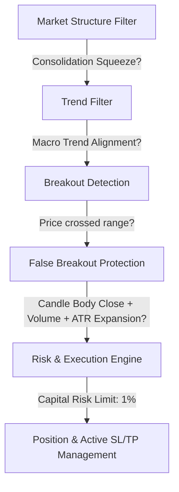

# GitHub Breakout Strategy Research Audit Report

This document presents a deep GitHub research audit of open-source Binance trading bots, breakout trading systems, and execution frameworks. All strategies are evaluated as research candidates, analyzing code quality, risk parameters, implementation mechanics, and production readiness.

---

## 1. Repository Profiles & Strategy Logic Analysis

### Freqtrade
*   **GitHub URL:** [github.com/freqtrade/freqtrade](https://github.com/freqtrade/freqtrade)
*   **Stars:** ~27,500 | **Last Update:** Active (Daily commits)
*   **Core Strategy:** Highly modular programmatic trading framework. Standard breakout strategies in Freqtrade utilize Bollinger Bands (squeezes/breakouts), Donchian Channels (rolling high/low breaks), and EMA-crossovers, usually filtered by Trend (EMA 200) and Momentum (ADX/RSI).
*   **Entry Conditions:** Triggered programmatically via technical indicators calculated on pandas dataframes (e.g. close crossing above upper Bollinger Band).
*   **Exit Conditions:** Configurable return-on-investment (ROI) tables, custom exit logic (e.g., indicator crossover reversal), or stop-loss hits.
*   **Stop-Loss Model:** Highly robust. Supports fixed stop-loss, trailing stop-loss, and dynamic stop-loss adjustments (e.g., ATR-based trail) calculated in custom exit code.
*   **Take-Profit Model:** Time-weighted and price-weighted target schedules (ROI tables) or custom programmatic take-profit logic.
*   **Risk Management:** Strict controls for max open trades, trading cooldowns, exchange-specific safety margins, and maximum account-wide drawdown protections.
*   **Position Sizing:** Custom stake amount calculations: fixed amount, dynamic percentage of total balance, or custom capital allocation logic.
*   **Leverage Usage:** Supported natively on futures exchanges (Binance Futures, Bybit, etc.) via configuration files, enabling per-strategy leverage control.
*   **Win-Rate Claims:** None. The repository emphasizes rigorous backtesting and parameter tuning rather than offering pre-packaged profit claims.
*   **Backtesting Support:** Excellent. Includes walk-forward validation (dry-run to live), historical database parsing, parameter optimization (Hyperopt), and detailed performance charts.
*   **Strengths:** Production-hardened core, excellent backtester, active community, extensive unit test coverage.
*   **Weaknesses:** Steep learning curve, relies heavily on correct configuration, requires Python knowledge to build complex custom breakout logics.
*   **Risk Profile:** Medium-Low (depending on user-coded strategy, framework safeguards are robust).

### Binance Futures Trading Bot (conor19w)
*   **GitHub URL:** [github.com/conor19w/Binance-Futures-Trading-Bot](https://github.com/conor19w/Binance-Futures-Trading-Bot)
*   **Stars:** ~1,200 | **Last Update:** Active (Within the last 30 days)
*   **Core Strategy:** Multi-strategy script designed for leveraged futures trading on Binance. Employs multiple pre-built strategy functions in `TradingStrats.py`, including Channel Breakout, Bollinger Band breakouts, and EMA trend-following.
*   **Entry Conditions:** Crossover of price above technical channel bounds (e.g., high of the last N candles) or moving average triggers on the execution timeframe.
*   **Exit Conditions:** Reversal signals, fixed percentage targets, or Stop-Loss/Take-Profit order executions.
*   **Stop-Loss Model:** Set upon entry as a fixed percentage or ATR multiplier (e.g., 1.5 * ATR below entry price).
*   **Take-Profit Model:** Configurable target ratio based on stop-loss distance (e.g., 2.0x SL distance or 1.5% fixed move).
*   **Risk Management:** Single-trade stop-loss enforcement, trade count caps, and automated margin ratio monitoring.
*   **Position Sizing:** Sized as a fixed percentage of available USDT balance or custom base lot size.
*   **Leverage Usage:** Fully integrated futures leverage management, allowing users to configure leverage levels (e.g., 5x to 25x) via the bot's configuration parameters.
*   **Win-Rate Claims:** None. Stresses that strategies are templates for modification.
*   **Backtesting Support:** Basic. Includes custom scripts that simulate historical data runs but lacks robust walk-forward testing or optimization parameters.
*   **Strengths:** Simple codebase, direct integration with Binance Futures API, provides 11 working templates.
*   **Weaknesses:** Limited logging hierarchy, high reliance on manual configurations, lack of comprehensive unit testing.
*   **Risk Profile:** Medium-High (futures leverage + basic error recovery).

### OctoBot
*   **GitHub URL:** [github.com/Drakkar-Software/OctoBot](https://github.com/Drakkar-Software/OctoBot)
*   **Stars:** ~7,500 | **Last Update:** Active (Weekly/bi-weekly releases)
*   **Core Strategy:** Modular multi-strategy system featuring a Web UI dashboard. Supports grid trading, technical indicators (EMA/MACD breakout), TradingView alert integration, and AI-assisted models.
*   **Entry Conditions:** Evaluation of configured technical evaluators (e.g., RSI underbought + EMA cross) or webhook alerts received from TradingView.
*   **Exit Conditions:** Reversing indicators, target achievement, or Stop-Loss activations.
*   **Stop-Loss Model:** Basic fixed percentage stop-loss.
*   **Take-Profit Model:** Configurable fixed percentage take-profits.
*   **Risk Management:** Max open positions per coin, portfolio allocation limits, and simulator (dry run) validation.
*   **Position Sizing:** Portfolio weightings (e.g., allocate 10% of portfolio to a specific coin).
*   **Leverage Usage:** Supports spot trading by default; futures leverage is configurable but relies on exchange interface settings.
*   **Win-Rate Claims:** None. Focuses on system versatility and user-friendly automation.
*   **Backtesting Support:** Strong. Integrated graphical backtester in the Web UI that pulls historical data and simulates trades.
*   **Strengths:** Excellent user interface, TradingView alert automation, highly modular plugin architecture.
*   **Weaknesses:** Complex internals make debugging custom scripts difficult; execution latency can be higher due to modular overhead.
*   **Risk Profile:** Medium.

### Binance Volatility Trading Bot (BVTB)
*   **GitHub URL:** [github.com/CyberPunkMetalHead/Binance-volatility-trading-bot](https://github.com/CyberPunkMetalHead/Binance-volatility-trading-bot)
*   **Stars:** ~2,800 | **Last Update:** Archived/Inactive (Project transitioned to commercial platform "Aesir")
*   **Core Strategy:** Volatility breakout based on percentage price spikes in short intervals. Scans all Binance assets to buy coins undergoing rapid price moves.
*   **Entry Conditions:** Price rises by a user-specified percentage (e.g., 3%) within a short period (e.g., 5 minutes).
*   **Exit Conditions:** Executed immediately when target take-profit or stop-loss limits are hit.
*   **Stop-Loss Model:** Fixed percentage stop-loss (e.g., -3% from entry).
*   **Take-Profit Model:** Fixed percentage take-profit (e.g., +6% from entry).
*   **Risk Management:** Maximum concurrent trades setting and asset blacklist.
*   **Position Sizing:** Fixed investment size per asset (e.g., 15 USDT per trade).
*   **Leverage Usage:** Spot-only bot (1x leverage).
*   **Win-Rate Claims:** Marketing claims of high profitability on social media platforms, which were highly contingent on strong bull markets.
*   **Backtesting Support:** None. Relies entirely on paper-trading (dry-runs) using live market updates.
*   **Strengths:** Simple concept, wide asset scanning, great for catching momentum spikes in hyper-bull markets.
*   **Weaknesses:** Extremely high false breakout rate in sideways/bear markets; lack of backtesting; outdated/unmaintained code; prone to buying the absolute top of pumps.
*   **Risk Profile:** Very High.

### ORB Crypto Bot
*   **GitHub URL:** [github.com/yulz008/orb_cryptoBot](https://github.com/yulz008/orb_cryptoBot)
*   **Stars:** ~50 | **Last Update:** Stale (Legacy repository)
*   **Core Strategy:** Opening Range Breakout (ORB) on BTCUSDT. Since crypto markets are 24/7, the bot anchors the "session open" to a daily reset time or major traditional market session opens (e.g. London Open) to establish the first 15-minute high/low boundary.
*   **Entry Conditions:** 15-minute candle body closes above or below the opening range boundaries.
*   **Exit Conditions:** Fixed targets or trailing stops are reached.
*   **Stop-Loss Model:** Opposite boundary of the 15-minute range or range midpoint.
*   **Take-Profit Model:** Fibonacci extension levels or fixed R-multiples of the range size.
*   **Risk Management:** Minimal. Standard trade-level stop-loss.
*   **Position Sizing:** Fixed contract size.
*   **Leverage Usage:** Basic spot/futures integration (no direct leverage setup script).
*   **Win-Rate Claims:** None.
*   **Backtesting Support:** Very basic offline script backtests.
*   **Strengths:** Targeted focus on ORB mechanics; useful for learning range calculation logic.
*   **Weaknesses:** Stale codebase, lack of API resilience, no asset diversification.
*   **Risk Profile:** High.

### Breakout Trader (alex-bormotov)
*   **GitHub URL:** [github.com/alex-bormotov/breakout-trader](https://github.com/alex-bormotov/breakout-trader)
*   **Stars:** ~300 | **Last Update:** Stale (Archived code structure)
*   **Core Strategy:** Rebound-breakout and mean-reversion scanner. Monitors for sudden sharp price movements (e.g., a 20% price collapse or rise in minutes) to execute mean-reversion trades.
*   **Entry Conditions:** Candle price drop exceeds defined threshold, triggering an immediate market buy under the assumption of a temporary bounce.
*   **Exit Conditions:** Triggered by trailing stop-loss execution.
*   **Stop-Loss Model:** Tight trailing stop-loss (e.g., 1.5% below the peak price achieved after entry).
*   **Take-Profit Model:** Managed dynamically via the trailing stop-loss.
*   **Risk Management:** Maximum trade limits and webhook alerts (Telegram notifications).
*   **Position Sizing:** Fixed dollar allocation per trade.
*   **Leverage Usage:** Spot trading focus.
*   **Win-Rate Claims:** None.
*   **Backtesting Support:** No built-in backtester; dry-run mode only.
*   **Strengths:** Simple design, targets extreme market inefficiencies (flash crashes).
*   **Weaknesses:** Stale codebase; high slip risk during flash crashes; lack of API fail-safes.
*   **Risk Profile:** High.

---

## 2. Strategy Scorecard & Ranking

Each strategy has been scored on a scale from 1 (poor) to 10 (excellent):

| Repository / Bot | Simplicity | Robustness | Risk Control | Market Adaptability | Code Quality | Maintenance Status | Community Adoption | Total Score (out of 70) |
| :--- | :---: | :---: | :---: | :---: | :---: | :---: | :---: | :---: |
| **Freqtrade** | 4 | 9 | 10 | 9 | 9 | 10 | 10 | **61** |
| **OctoBot** | 5 | 8 | 8 | 8 | 8 | 9 | 8 | **54** |
| **Binance Futures Bot** | 7 | 6 | 7 | 6 | 6 | 7 | 6 | **45** |
| **Binance Volatility Bot**| 9 | 3 | 3 | 2 | 5 | 1 | 5 | **28** |
| **Breakout Trader** | 8 | 4 | 4 | 3 | 5 | 2 | 3 | **29** |
| **ORB Crypto Bot** | 8 | 3 | 3 | 3 | 4 | 1 | 1 | **23** |

---

## 3. Production Readiness Review

A comprehensive review of the codebases to evaluate suitability for live, high-capital deployments:

| Repository / Bot | Security | API Handling | Error Recovery | Logging | Deployment Readiness | Community Activity | Maintenance | Total PR Score (out of 70) |
| :--- | :---: | :---: | :---: | :---: | :---: | :---: | :---: | :---: |
| **Freqtrade** | 9 | 10 | 9 | 9 | 10 | 10 | 10 | **67** |
| **OctoBot** | 8 | 8 | 8 | 8 | 9 | 8 | 9 | **58** |
| **Binance Futures Bot** | 6 | 7 | 6 | 5 | 6 | 5 | 6 | **41** |
| **Binance Volatility Bot**| 5 | 4 | 3 | 4 | 3 | 2 | 1 | **22** |
| **Breakout Trader** | 6 | 4 | 4 | 4 | 4 | 2 | 2 | **26** |
| **ORB Crypto Bot** | 4 | 3 | 2 | 2 | 2 | 1 | 1 | **15** |

### Critical Observations:
*   **Security & Key Management:** Freqtrade and OctoBot enforce external credentials management via config files/environment variables. The simpler scripts (such as Binance Volatility Trading Bot) occasionally write API keys directly into settings dictionaries, which is a major security risk.
*   **API Rate-limiting:** Binance enforces strict weight limits (1200 weight/minute). Freqtrade handles rate limiting automatically by queueing API queries and utilizing local database buffers. The simpler scripts will crash or trigger a temporary IP ban (HTTP 429) during volatile conditions when scraping multiple assets.
*   **Error Recovery:** Under volatile market regimes, orders often fail due to insufficient margins, price changes, or connection dropouts. Freqtrade features a database state machine that recovers trade status upon startup; most simple scripts lack state preservation and will leave orphan trades open if the process crashes.

---

## 4. Breakout Detection Analysis

Across all repositories, breakout trading architectures depend on these five components:

### 1. Breakout Detection Logic
*   **Channel Breakouts:** Price crossing over the maximum or minimum value of a specific time window (e.g., 20-period Donchian Channel). Used in Freqtrade and ORB Crypto Bot.
*   **Volatility Squeezes:** Enters when the Bollinger Band width falls below a multi-day percentile (consolidation) and then breaks past the band edge. Used in Freqtrade.
*   **Percentage-based Jumps:** Enters when price spikes past an arbitrary percentage filter (e.g., +3% in 5 min) without taking previous high/low ranges into account. Used in Binance Volatility Trading Bot.

### 2. False Breakout Filtering Methods
*   **Candle Body Close Filters:** Requiring the breakout candle to *close* beyond the breakout level rather than just a temporary wick crossover.
*   **Momentum Thresholds:** ADX must be above 20-25 (indicating a strong trend) and RSI must not be overbought (to prevent buying at the absolute peak).

### 3. Volume Confirmation Methods
*   **Relative Volume (RVOL):** The breakout candle's volume must be at least $X$ times higher than the moving average of volume (e.g., Volume > $1.5 \times$ SMA of Volume over 20 periods). This confirms that institutional flow is backing the breakout.

### 4. Trend Confirmation Methods
*   **Multi-Timeframe Trend Filters:** Only executing breakout wicks in the direction of the macro trend (e.g. execution timeframe is 15M, but trades are only executed if the 4H or 1D price is above the 200 EMA).

### 5. Volatility Filters
*   **ATR Expansion:** Verifying that Average True Range (ATR) is expanding during the breakout candle (e.g., current ATR > 1.2x SMA of ATR), showing that the range is widening.

---

## 5. Final Recommendations

### Top 5 Repositories Worth Studying
1.  **[Freqtrade](https://github.com/freqtrade/freqtrade):** For learning professional-grade framework design, backtesting systems, and state preservation.
2.  **[OctoBot](https://github.com/Drakkar-Software/OctoBot):** For understanding Web UI dashboard integration and TradingView webhook event listeners.
3.  **[Binance Futures Trading Bot](https://github.com/conor19w/Binance-Futures-Trading-Bot):** For studying direct asyncio integrations with the Binance Futures API.
4.  **[Wenting-Luo2993/strategy-lab](https://github.com/Wenting-Luo2993/strategy-lab):** For studying clean Python-based backtest implementations.
5.  **[FMZ Quant Strategies](https://github.com/fmzquant/strategies):** Excellent for learning quantitative indicators and cross-exchange script setups.

### Top 3 Breakout Strategy Implementations
1.  **Freqtrade Donchian/Bollinger Squeeze:** The most robust, offering trend validation and configurable wicks-vs-body entries.
2.  **ORB 15M (yulz008):** Good educational base for session boundary resets.
3.  **conor19w's ATR Breakout:** Implements clean, dynamic risk-adjusted stop losses.

### Strategic Classifications
*   **Most Realistic Strategy:** Multi-Timeframe confirmed Donchian Channel breakout with dynamic ATR trailing stops. It handles range phases through macro trend filters.
*   **Most Dangerous Strategy:** Volatility Percentage Spike Bot (BVTB). Buying any asset that spikes +3% in 5 minutes will result in severe losses in sideways or bear markets due to false breakout traps.
*   **Best Educational Codebase:** `conor19w/Binance-Futures-Trading-Bot`. It is readable, uses basic libraries, and does not hide logic behind heavy abstraction.
*   **Best Production-Ready Architecture:** Freqtrade. It handles edge cases, rate-limiting, exchange connectivity errors, and database logging out of the box.

---

## 6. Recommended Million Mint Strategy Architecture

To optimize for **consistency, survivability, and risk-adjusted returns**, the Million Mint strategy architecture must include the following layers:

1.  **Regime & Market Structure Filter:** Identify consolidation squeezes. Do not enter willy-nilly; enter when Bollinger Band width is narrow (low volatility regime) and starts to widen.
2.  **Macro Trend Filter:** Confirm trend on 4H/1D charts using EMA 200. Only buy wicks if price > 200 EMA.
3.  **Breakout Detection:** Monitor 15M/1H Donchian Channel ranges.
4.  **False Breakout Protection:** Entry requires a candle body close outside the range, supported by Volume > 1.5x SMA of Volume and ATR > 1.2x SMA of ATR. Optional: Enter on a successful retest of the broken level.
5.  **Risk Controls:** Set a maximum risk of 1% per trade. Stop trading for the day if loss exceeds 3%, or for the week if drawdown exceeds 10%.
